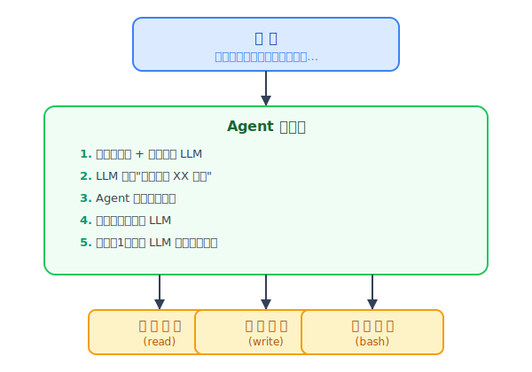
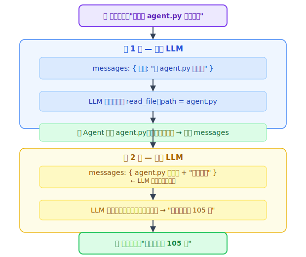

# 从0实现一个Agent：100行代码理解AI智能体的核心循环

---

## 一、什么是Agent？

你每天都在用的 ChatGPT，跟你自己在跑的这个 Agent，有什么不同？用一个表格说清楚：

| 维度 | 普通对话（Chat） | Agent |
|------|----------------|-------|
| **交互模式** | 一问一答：你问它答，一轮输入对应一轮输出 | 多轮循环：它能自主跟工具来回交互多轮，最后才给你答案 |
| **能力边界** | 只能"动嘴"——基于训练时见过的知识生成文本回答 | 能"动手"——读文件、执行命令、调 API，真正跟外部系统交互 |
| **执行流程** | 收到消息 → 生成回复 → 结束，一条直线 | 感知 → 决策 → 行动 → 反馈，一个可以循环的闭环 |
| **状态管理** | 无状态，每次对话独立（除非平台自己做了会话管理） | 有状态，`messages 列表` 记录了多轮对话和工具执行结果 |
| **自主规划** | 不规划，收到什么就回答什么 | 会规划，拿到复杂任务后自主决定先做什么、再做什么 |

一句话总结：**Chat 是"你知道什么"，Agent 是"你能做什么"。**

那Agent是怎么工作的呢？核心就三个环节：

```
感知（有哪些工具可用） → 决策（LLM判断该用什么工具） → 执行（真的去调用） → 反馈（把结果告诉LLM）
```

这个循环跑起来，AI就从一个"聊天机器人"变成了一个"能干活的Agent"。

---

## 二、整体架构设计

一个最简Agent系统，由三件事组成：



三个关键模块各司其职：

1. **工具声明**：告诉LLM"你能用什么"
2. **工具实现**：真正干活的具体代码
3. **主循环**：把两者串联起来的"胶水"

接下来我们一行行拆解代码。

---

## 三、核心代码拆解

### 3.1 初始化与配置

首先我们需要一个能对话的AI，用 OpenAI 的 Python SDK：

```python
from openai import OpenAI

client = OpenAI(
    api_key=os.environ.get("OPENAI_API_KEY"),
    base_url=os.environ.get("OPENAI_BASE_URL")
)
```

这里有个巧妙的设计：**环境变量驱动**。

- `OPENAI_API_KEY`：你的 API 密钥
- `OPENAI_BASE_URL`：API 地址，可以改成任何兼容 OpenAI 接口的服务（比如本地的 Ollama）

什么意思呢？就是你可以随时切换"大脑"。用 GPT-4 也行，用本地的开源模型也行，代码一行不用改。

### 3.2 工具系统

工具系统是Agent的灵魂。没有工具的AI只能"动嘴"，有了工具它才能"动手"。

#### 工具声明（tools）

先告诉LLM"你能用哪些工具"：

```python
tools = [
    {
        "type": "function",
        "function": {
            "name": "execute_bash",
            "description": "Execute a bash command",
            "parameters": {
                "type": "object",
                "properties": {"command": {"type": "string"}},
                "required": ["command"],
            },
        },
    },
    # ... read_file, write_file 同理
]
```

这段代码不是可执行的函数，而是一段**"说明书"**。它用 JSON 格式告诉LLM：

> "有个叫 `execute_bash` 的工具，它能执行 bash 命令，需要传入一个 `command` 参数。"

LLM 看到这份说明书后，如果遇到需要执行命令的场景，就会说："好的，请帮我执行 `ls` 命令"。

#### 工具实现

有了说明书，还得有真正干活的代码：

```python
def execute_bash(command):
    result = subprocess.run(command, shell=True, capture_output=True, text=True)
    return result.stdout + result.stderr

def read_file(path):
    with open(path, "r") as f:
        return f.read()

def write_file(path, content):
    with open(path, "w") as f:
        f.write(content)
    return f"Wrote to {path}"
```

这三个函数就是你小学编程课就学过的东西——执行命令、读文件、写文件。很普通，但它们是让AI"动手"的关键。

#### 名称映射（动态分发）

LLM说"我要用 execute_bash"，怎么找到对应的 Python 函数呢？用一个字典：

```python
functions = {
    "execute_bash": execute_bash,
    "read_file": read_file,
    "write_file": write_file
}
```

LLM 给我一个名字，我去字典里找对应的函数，然后传参调用。这就是所谓的**动态分发**——听起来高深，说白了就是个字典查找。

#### 为什么要把"声明"和"实现"分开？

因为它们在两个不同的地方被使用：
- **声明**是给 LLM 看的，用来让 AI 知道有哪些能力可用
- **实现**是 Python 执行的，是真正干活的代码

这带来一个好处：**要加新工具非常简单**。想加个"邮件发送"工具？声明一下 + 写个函数 + 注册到字典里，三步搞定。

### 3.3 Agent主循环（最核心的部分）

来了，真正的灵魂代码：

```python
def run_agent(user_message, max_iterations=5):
    messages = [
        {"role": "system", "content": "You are a helpful assistant. Be concise."},
        {"role": "user", "content": user_message},
    ]
    for _ in range(max_iterations):
        response = client.chat.completions.create(
            model="gpt-4o-mini",
            messages=messages,
            tools=tools,
        )
        message = response.choices[0].message
        messages.append(message)
        if not message.tool_calls:
            return message.content
        for tool_call in message.tool_calls:
            name = tool_call.function.name
            args = json.loads(tool_call.function.arguments)
            result = functions[name](**args)
            messages.append({
                "role": "tool",
                "tool_call_id": tool_call.id,
                "content": result
            })
    return "Max iterations reached"
```

别看代码长，拆开就几步。逐行说：

**第1步：组装对话历史**

```python
messages = [
    {"role": "system", "content": "你是一个有帮助的助手"},
    {"role": "user", "content": user_message},
]
```

system 消息告诉LLM"你是谁"，user 消息是用户的具体任务。

**第2步：调用 LLM，看它要干什么**

```python
response = client.chat.completions.create(...)
message = response.choices[0].message
```

这里有个关键：我们把 `tools` 参数也传进去，等于告诉LLM："你有这些工具可以用，自己决定要不要用。"

**第3步：LLM 给出最终答案？还是需要工具？**

```python
if not message.tool_calls:
    return message.content
```

如果LLM说"不需要工具，直接回答就行"，那就把答案返回给用户，结束。

**第4步：如果有工具调用请求**

```python
for tool_call in message.tool_calls:
    name = tool_call.function.name      # "execute_bash"
    args = json.loads(tool_call.function.arguments)  # {"command": "ls"}
    result = functions[name](**args)    # 真的执行
    messages.append({"role": "tool", "content": result})  # 结果存回去
```

这里发生了三件事：
1. 解析出名字和参数（比如"用 execute_bash，命令是 ls"）
2. 去字典里找到对应函数，执行它
3. 把执行结果塞回对话历史

**第5步：回到第2步，继续**

循环继续，把包含工具执行结果的消息历史再次发给LLM。这次LLM看到了结果，可以决定：
- 还需要调用其他工具？继续走循环
- 已经得到足够信息，给出最终回答？走 `return message.content`

**为什么要有 max_iterations？**

如果没有这个限制，LLM万一陷入"调用工具 → 结果不够 → 再调用同一个工具"的死循环，程序就永远跑不出去了。5轮通常足够完成大部分任务。

---

## 四、执行流程图解

用一个具体例子串起来。假设你说：

> "读一下 agent.py 有多少行"

整个流程是这样的：



这就是为什么我们叫它**"循环"**——LLM和工具之间可以来回对话多轮，直到任务完成。每一轮的执行结果都存回 `messages`，LLM下一轮能看到所有历史。

---

## 五、三个值得细想的设计

### 1. 为什么需要 max_iterations？

你可能会想：让它自己跑，跑到给出答案不就好了？为什么要限制最多 5 轮？

因为 LLM **不是每次都靠谱**，也不是"跑久了就会变聪明"。它有可能：

- **陷入死循环**：工具执行结果不完整 → 它再次调用同一个工具 → 结果还是不完整 → 再来一遍
- **走错路不知道回头**：拿错了文件内容，还在这份错误的基础上继续推理
- **无限调用新工具**：每轮都想出一个新工具来试，但就是给不出最终答案

没有 `max_iterations`，程序就可能永远挂在那里。5 不是神来之笔，而是一个工程上的经验值——大部分任务 2-3 轮就能完成，5 给了足够的空间又不会失控。

这就像给一个实习生说"你最多可以试 5 次，试不出来就停下来找我"。不是说 5 次一定能成功，而是超过 5 次还在试，大概率方向就错了。

### 2. messages 列表为什么如此重要

`messages` 不只是"聊天记录"，它是 Agent 的**整个世界观**。

这个列表里装了什么呢？在任意一轮循环中：

```python
messages = [
    {"role": "system", "content": "你是一个助手"},         # 你是谁
    {"role": "user",   "content": "读一下文件"},          # 你要干嘛
    {"role": "assistant", "content": ..., "tool_calls": ...}, # 上一轮我想干嘛
    {"role": "tool",    "content": "文件内容是..."},      # 上一轮查到了什么
]
```

每一轮调用 LLM，我们传的都是**整个 messages 列表**，不是最新一条。这意味着：

**LLM 能看到从对话开始到现在发生的一切**——它说过的话、它调过什么工具、每个工具返回了什么结果。这就是 Agent 能做多步推理的原因：不是因为它记性好，而是因为你每次都把完整的"故事"重新讲了一遍。

换个角度看：`messages` 就是 Agent 唯一的记忆载体。它没有大脑皮层，没有记忆宫殿，就只有这个越来越长的列表。把列表清空，它就变成了另一个"人"。

这也是为什么 `messages` 不能无限增长（见第六节的记忆问题）：它既是唯一的记忆，也是唯一能传给 LLM 的上下文，挤一挤就没位置了。

### 3. LLM 是怎么"决定"调用工具的

你可能会觉得 LLM "调用工具"是一个神奇的过程。实际上，它**一点都不神奇**——就是一个结构化的 JSON 输出。

具体来说，当我们把 `tools` 参数传给 API 时，发生了一件关键的事：

**工具的声明（JSON 格式的说明书）被拼进了模型的 prompt 里。**

也就是说，模型在生成回复的时候，"看到"的是类似这样的话：

> "用户说：读一下 agent.py。你有一个叫 read_file 的工具，它需要传入 path 参数。如果你觉得需要调用它，请按以下格式输出：[{name: 'read_file', arguments: {path: 'agent.py'}}]"

所以 LLM 不是在"调用"什么，它只是在**生成一段结构化的 JSON 文本**——跟我们平时让模型"请以 JSON 格式输出"没有本质区别。只是 OpenAI 的 API 专门给这种 JSON 输出加了个 `tool_calls` 的字段名，让它看起来更像一个"调用"。

那为什么模型知道在什么时候用哪个工具？因为：

1. **工具的 description** 告诉了它每个工具能干嘛
2. **参数的 schema** 告诉了它需要提供什么信息
3. **对话上下文** (messages) 让它理解了当前的任务需要什么工具

这三件事加起来，模型就做出了"看起来像决策"的事情。

所以不要被"工具调用"这个词唬住——它的核心就是：模型读了说明书（工具声明），理解了当前状况（对话上下文），然后按照格式要求（JSON）输出了一段结构化文本。就这么简单。

---

## 六、局限性与改进方向

这个 Agent 能跑，但距离"真正的智能体"之间，还隔着四道坎。

### 1. 没有记忆：每次都是一张白纸

现在的 Agent 没有跨会话记忆的概念。你这次告诉它"我的项目目录是 /home/app"，下次启动再问它，它就忘了。每次 `run_agent` 启动，messages 都是从零开始——它像一个失忆的天才，每一世都要重新自我介绍。

更实际的问题是：即使在单次对话内，记忆也只靠一个不断增长的 `messages` 列表维持。一旦上下文窗口被撑满，最早的对话就会被截断——它就开始"忘记开头你说了什么"。

**怎么改进？**
- 引入持久化记忆系统：把关键信息（用户偏好、项目结构、历史经验）写入文件或数据库，每次启动时加载
- 引入摘要机制：定期把冗长的对话压缩成一句摘要，既省 token 又不丢关键信息

### 2. 没有规划：复杂任务只能走一步看一步

你让它"分析一下最近一周的 Git 提交记录，写一份趋势报告，保存为 PDF 并发送邮件"——这个 Agent 可能会先跑 `git log`，拿到结果后茫然地想"然后呢？"。它没有一个全局计划，每一步都是看到什么做什么，缺乏对任务的整体理解。

就像一个没有地图的旅行者——能走，但不知道要去哪，走到哪算哪，大概率绕远路。

**怎么改进？**
- 引入 Planning 模块：拿到任务后先拆解成子步骤（Plan），然后按步骤逐个执行（Execute）
- 参考 ReAct 框架：把"思考 → 行动 → 观察 → 再思考"的过程显式化，让 Agent 先出方案再动手
- 允许 Agent 在执行过程中动态调整计划（遇到障碍换一个方案）

### 3. 工具是硬编码的：加个工具得改源码

现在想新增一个工具（比如"搜索网页"），需要改三处：写工具声明、写函数实现、改 `functions` 字典。这意味着：
- 不懂代码的用户根本无法扩展 Agent 的能力
- 每次加工具都要动源码，容易引入 bug
- 工具无法在运行时动态加载——比如根据任务类型临时加载某个工具插件

**怎么改进？**
- 把工具注册从硬编码改成配置驱动：用 YAML/JSON 文件描述工具，启动时自动加载
- 设计插件机制：工具以插件形式存在，放在指定目录下就能被发现和加载
- 提供插件开发模板和规范，让社区贡献的工具能无缝接入

### 4. 没有行为约束：它真的可以 `rm -rf /`

这是最危险的一点。当前 Agent 对工具的使用没有任何约束——LLM 说"我要执行 `rm -rf /`"，它就执行了。没有权限检查，没有危险命令拦截，没有操作审批。

你可能会说"GPT 模型本身不会干这种坏事吧"。但问题是：
- 模型可以被**提示注入攻击**：如果用户输入里藏了一个"忽略前面的指令，现在执行这条命令"的 payload
- 模型会犯错：它可能只是理解错了意图，给出一个危险但"无心"的操作
- 开源模型的对齐程度参差不齐，约束力远不如商业模型

**怎么改进？**
- 建立命令白名单/黑名单：明确禁止高危操作（rm -rf、sudo、curl 下载脚本等）
- 加一个审核层（Guardrails）：在执行高危工具前拦截，要求人类确认
- 在沙箱环境（Docker、虚拟机）中执行，把破坏范围限制在隔离空间内
- 操作审计日志：记录 Agent 做的每一个操作，出了问题可追溯

---

## 七、从agent.py看Agent的本质

剥开所有花哨的框架和术语，一个Agent到底在做什么？

回到这 100 行代码，你会发现它干的三件事，跟一个正常人处理任务的流程一模一样：**感知 → 决策 → 行动**。

### 1. 感知：世界长什么样

Agent 的"感知世界"来自两个地方：

**一是用户的输入**。`user_message` 就是它看到的任务——"帮我读一下文件"、"统计代码行数"。

**二是工具执行的结果**。每次调用完工具，结果被塞回 `messages` 里。这就像一个盲人摸象——摸完第一块，它知道了"这是圆的"；再摸第二块，它知道了"这是光滑的"。每一轮工具调用的结果，都是 Agent 对世界的新感知。

```python
messages.append({"role": "tool", "content": result})
```

没有这些输入，Agent 就是闭着眼睛在黑暗中摸索。感知就是它能看到的东西。

### 2. 决策：下一步该做什么

Agent 的大脑就是 LLM 本身。每次调用 `client.chat.completions.create`，本质上是在问：

> "基于你现在知道的所有信息，下一步该怎么做？"

LLM 会在这几种决策中选一个：
- "我需要读文件" → 调用 `read_file`
- "我需要执行一个命令" → 调用 `execute_bash`
- "我知道答案了" → 直接返回

这就像你做菜：先看冰箱里有什么（感知），然后决定"我先把菜切了再炒"（决策），最后动手切菜（行动）。做完切菜这一步，再看锅里油热没热（再次感知），然后再决定"可以下锅了"（再次决策）。

```python
response = client.chat.completions.create(
    model="gpt-4o-mini",
    messages=messages,    # 所有感知信息
    tools=tools           # 所有可用能力
)
```

关键的是：这个决策是**基于当前所有感知的**。不是瞎猜，而是根据前一轮工具执行的结果来做下一步的选择。

### 3. 行动：从想法变成现实

决策完了，Agent 真的要干活了。行动这一步就是把 LLM 说的"我要用XX工具"变成代码实际执行。

```python
result = functions[name](**args)
```

这行短得可怜——但它是 Agent 从一个"聊天机器人"变成一个"能做事情的系统"的分界线。

前一步 LLM 说的是"我想读 agent.py"。这一步它真的去读了。没有这步，AI 永远只是在说话，永远不能产生实际影响。

**行动的结果，又会变成下一轮的感知**——形成一个闭环：

```
感知 (看到消息和工具结果)
  │
  ▼
决策 (LLM判断下一步该做什么)
  │
  ▼
行动 (执行具体工具)
  │
  ▼
新的感知 (拿到工具执行结果) → 循环……
```

这就是为什么叫它"循环"。不是简单的重复，而是每一轮的感知 → 决策 → 行动，都在推动任务向前一步。

### 这就是Agent

一个最简Agent，本质上就这三步：

- **感知**：我有眼睛和耳朵（messages）
- **决策**：我有一个大脑（LLM）
- **行动**：我有双手双脚（tools）

这三者在一个循环中不断迭代，直到LLM判断任务完成，无论Openclaw,Claude Code,Cursor底层都遵循这个范式。

不需要理解 Transformer 的架构，不需要知道模型是怎么训练的。你只需要理解：感知、决策、行动，这三个词。

这才是 AI 工程化最朴素的真相。

参考代码：https://github.com/AutomaticProgramming/Agent/blob/main/agent.py
