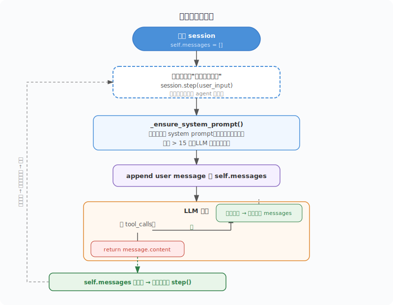

# 从零开始理解Agent(三)：多轮对话让Agent真正"活"起来

第一篇我们用 100 行代码，实现了一个能"感知 → 决策 → 行动"的 Agent。第二篇给它装上了记忆系统，解决了跨会话失忆和上下文撑爆的问题。

但还有一个遗憾没有填补：这个 Agent 每次只能"问一次答一次"。你给它一个任务，它跑一圈出结果，然后就结束了——想再聊？得重新启动一次。

**真正的对话不是这样的。** 你跟朋友聊天，不会每说一句话就挂断电话，然后再拨一次。你会说上句，他回下句，然后你接着说，他接着答，来回几十轮。

这篇我们给 Agent 装上这种能力——多轮对话。

---

## 一、什么是多轮对话？为什么它和"单次调用"不一样

第一篇的 `run_agent` 函数，接收一条用户消息，跑完一个 agent 循环，返回答案。然后就结束了——`messages` 列表被销毁，下次调用又是从零开始。

想象你去餐厅只点一道菜，吃完服务员把桌子收拾干净。你再想点菜？重新排队、重新点单。这就是 `run_agent`。

多轮对话是另一种模式。你坐下来，点了一道菜。吃完觉得不错，还想再加一道菜——服务员直接过来记，不会让你重新排队。**桌子没清，你还坐在那里。**

| 维度 | `run_agent` (单次调用) | `AgentSession` (多轮对话) |
|------|------|------|
| **生命周期** | 调用一次就销毁 | 持续存活，跨轮次复用 |
| **消息历史** | 每次从零构造 | 累积保留上一轮的内容 |
| **退出时机** | 跑完一次就结束 | 用户主动退出才结束 |
| **适合场景** | "帮我做一件事" | "我们聊聊，你逐步帮我完善" |

关键区别只有一个：**消息列表在轮次之间不销毁。**

这带来的体验差异是巨大的：

第一轮：你说"我想做一个待办清单"，Agent 说"好的，请告诉我有哪些事项"。

第二轮：你说"第一件是买咖啡"，Agent 说"好的，还有呢？"。

第三轮：你说"第二件是看医生"，Agent 说"收到，你的清单一共有两项：1. 买咖啡  2. 看医生。还需要加吗？"

第三轮的回答依赖第一轮和第二轮的上下文。如果每次都是零开始，第三轮的 Agent 根本不知道"清单"和"第二件"是什么意思。

这就是多轮对话——不是技术上的大突破，而是**让 Agent 的循环不关掉**。

---

## 二、从函数到类：`AgentSession` 的设计

### 为什么用 class 不用 function

函数执行完就释放了内部的所有状态。你想在两次函数调用之间保留什么东西？只能存到外部变量里，或者写个全局变量。这很丑。

class 不一样。class 的实例就像一个盒子，盒子里的东西在你不砸盒子之前一直存在。

```python
class AgentSession:
    def __init__(self, memory_manager):
        self.memory = memory_manager
        self.messages = []       # 对话历史，跨轮次存活
        self._initialized = False
```

`self.messages` 就是那个关键的东西——它不属于某一次调用，它属于整个 session。你调用一次 `step()`，往里面追加消息，它保留。你再调用一次 `step()`，它还在，并且继续追加。

### 三个方法职责分明

```python
def _ensure_system_prompt(self):
    """仅在 session 首次调用时设置 system prompt，并检查是否需要压缩。"""

def step(self, user_message: str, max_iterations: int = 10) -> str:
    """添加用户消息 → 执行 agent 循环 → 返回最终回答。"""
```

`_ensure_system_prompt()` —— 准备系统提示，检查记忆压缩。只在 session 第一次接收消息时设置 system prompt，后续轮次跳过。

`step()` —— 核心方法。接收一条用户消息，执行 agent 循环，返回最终回答。`messages` 不销毁，等待下一次调用。

### 改造对比：从 `run_agent` 到 `AgentSession.step()`

改造前的 `run_agent`（第一篇的代码）：

```python
def run_agent(user_message):
    messages = [
        {"role": "system", "content": "You are a helpful assistant"},
        {"role": "user", "content": user_message},
    ]
    # ... 执行循环 ...
    return message.content   # 返回后 messages 就没了
```

改造后的 `AgentSession.step()`：

```python
def step(self, user_message: str, max_iterations: int = 10) -> str:
    self._ensure_system_prompt()
    self.messages.append({"role": "user", "content": user_message})  # 追加

    for i in range(max_iterations):
        # ... 执行循环，往 self.messages 追加 ...

    return message.content   # 返回后 self.messages 还在
```

区别一目了然：**`messages` 从局部变量变成了实例属性 `self.messages`。** 函数返回时不被销毁，下一次 `step()` 调用还能看到前面的内容。

---

## 三、`step()` 方法逐行拆解

接下来我们把 `step()` 方法拆开看。它是多轮对话的核心，但内部逻辑跟第一篇的 agent 循环几乎是一样的，只是换了一个存活更久的容器。

### 第1步：确保 system prompt 存在

```python
def step(self, user_message: str, max_iterations: int = 10) -> str:
    self._ensure_system_prompt()
```

`_ensure_system_prompt()` 做了两件事：

**一、首次启动时设置 system prompt。**

```python
def _ensure_system_prompt(self):
    if not self._initialized:
        knowledge = self.memory.get_all()   # 从第二篇的记忆系统加载
        self.messages.append({
            "role": "system",
            "content": _make_system_prompt(knowledge),
        })
        self._initialized = True
```

Agent "带着记忆出生"——长期记忆里记过什么，system prompt 里就注入什么。这是第二篇已经做过的。

**二、检查是否需要记忆压缩。**

```python
    if len(self.messages) > SHORT_MEMORY_LIMIT:
        self.messages = self.memory.summarize(self.messages, client)
```

`SHORT_MEMORY_LIMIT` 默认 15 条。超过这个数，`messages` 列表会被 LLM 自动压缩——把几十条对话浓缩成几句话的摘要。这也是第二篇的内容。

这一步巧妙之处在于：**压缩检查和 system prompt 设置放在同一个方法里。** 每次 `step()` 都要先过这道门——第一次开门设置 system，后续开门检查要不要压缩。不需要用户操心，Agent 自己判断。

### 第2步：追加用户消息

```python
    self.messages.append({"role": "user", "content": user_message})
```

把用户输入加到对话历史末尾。注意是 `append`，不是替换。每一轮的用户消息都留在 `self.messages` 里，成为后续轮次的上下文。

### 第3步：执行 agent 循环

```python
    for i in range(max_iterations):
        response = client.chat.completions.create(
            model=os.environ.get("OPENAI_MODEL", "DeepSeek-V3.2"),
            messages=self.messages,
            tools=tools,
        )
        message = response.choices[0].message
        self.messages.append(message)
```

跟第一篇完全一样：调用 LLM，拿到回复，追加到对话历史。唯一不同的是 `messages` 现在跨轮次存活。

### 第4步：判断有没有工具调用

```python
        if not message.tool_calls:
            return message.content
```

LLM 说"不需要工具了，直接回答"，方法返回答案。**但 `self.messages` 没有清空**——这一轮的所有对话都留在那里，等下一轮 `step()` 继续累积。

### 第5步：如果有工具调用，处理后继续循环

```python
        for tool_call in message.tool_calls:
            name = tool_call.function.name
            args = json.loads(tool_call.function.arguments)

            if name == "save_memory":
                result = self.memory.save(args["key"], args["value"])
            elif name == "search_memory":
                matches = self.memory.search(args["query"])
                result = json.dumps(matches, ensure_ascii=False) if matches else "No matching memories found."
            elif name == "summarize_memory":
                self.messages = self.memory.summarize(self.messages, client)
                result = "Conversation history summarized."
            elif name in functions:     # execute_bash, read_file, write_file
                result = functions[name](**args)

            self.messages.append({
                "role": "tool",
                "tool_call_id": tool_call.id,
                "content": str(result),
            })
```

处理工具调用，结果写回 `self.messages`，然后外层 `for` 循环继续——LLM 拿到工具执行结果，决定下一步。

整个过程跟第一篇的 agent 循环一模一样，唯一的区别是：**循环的结果不销毁，留到下一次 `step()` 调用时还在。**

---

## 四、REPL：让 Agent"活"在终端里

### 什么是 REPL

REPL 全称是 **Read-Eval-Print Loop**（读取-求值-打印-循环）。你可能用过 Python 的交互模式——打开终端输入 `python`，出来一个 `>>>` 提示符，你输代码它出结果——这就是一个 REPL。

用大白话说就是：**你说一句，它答一句，一直循环下去。**

这跟人面对面聊天是一个模式：你说 → 他想 → 他答 → 你说 → 他想 → 他答……无限循环，直到你说"走了"。

### 实现代码

`agent_3.py` 的入口代码只有十行左右：

```python
if __name__ == "__main__":
    import sys

    session = AgentSession(memory)

    # 支持命令行传入初始任务
    task = " ".join(sys.argv[1:]) if len(sys.argv) > 1 else None
    if task:
        print(session.step(task))

    # 交互式多轮对话
    while True:
        try:
            user_input = input("\n> ").strip()
        except (EOFError, KeyboardInterrupt):
            break
        if user_input in ("quit", "exit"):
            break
        if not user_input:
            continue
        print(session.step(user_input))
```

拆解每一行的意图：

**`session = AgentSession(memory)`**

创建一个会话对象。整个 session 的生命周期从现在开始——你可以调用一百次 `session.step()`，它都在，`self.messages` 一直在累积。

这里 `memory` 是第二篇的 `MemoryManager` 实例，负责长期记忆。`AgentSession` 拿到它，每次 `step()` 时自动加载和保存。

**初始任务处理（可选）**

```python
task = " ".join(sys.argv[1:]) if len(sys.argv) > 1 else None
if task:
    print(session.step(task))
```

支持直接从命令行给 Agent 一个初始任务，比如 `python agent_3.py 帮我看看目录里有哪些文件`。Agent 执行完这个任务后不会退出——继续进入下面的 `while True` 循环，等待你进一步指令。

**`while True` 循环**

```python
while True:
    user_input = input("\n> ").strip()
```

打印一个 `> ` 提示符，等待用户输入。然后 `.strip()` 去掉前后空白。

**退出条件**

```python
    if user_input in ("quit", "exit"):
        break
```

输入 `quit` 或 `exit` 退出。`Ctrl+D`（EOFError）和 `Ctrl+C`（KeyboardInterrupt）也会优雅退出，不会报错崩溃。

**跳过空输入**

```python
    if not user_input:
        continue
```

直接回车不输入内容？不处理，继续等待。

**调用并打印结果**

```python
    print(session.step(user_input))
```

核心只有一行——把用户输入交给 session 处理，拿到结果后打印出来。然后回到循环开头，等待下一轮输入。

### 一个实际运行示例

```
$ python agent_3.py

> 我有一个想法，想做一个简单的命令行天气查询工具

好的，这是一个很实用的项目。让我先看看当前目录里有哪些文件：

[Tool] execute_bash({'command': 'ls'})
.
agent_1.py
agent_2.py
agent_3.py
README.md

你有什么技术栈偏好吗？比如用 Python 还是其他语言？

> 用 Python，最好是纯命令行不依赖复杂依赖

没问题，我可以设计一个最小化的版本。让我想想需要调用什么 API……

[Tool] execute_bash({'command': 'curl -s wttr.in/Beijing?format=3'})

像 wttr.in 这样的服务不需要任何 API key，一行命令就能返回天气信息。要我先写个简单的查询脚本试试？

> 好，写一个看看

[Tool] write_file({'path': 'weather.py', 'content': 'import sys\n...'})
Wrote to weather.py

写好了，你可以运行 `python weather.py 北京` 试试看。

> 能加上查询未来三天的功能吗？

[Tool] write_file({'path': 'weather.py', 'content': '...更新后的版本...'})

好的，已经更新。现在默认显示三天预报。

> quit
```

注意观察：

- 第一轮 Agent 问你偏好，第二轮你回答，它记住了上下文
- 第三轮直接说"好，写一个看看"——它知道"一个"指的是第二轮提到的"简单的查询脚本"
- 第四轮说"加上查询未来三天的功能"——它知道你说的是刚才生成那个脚本

这就是多轮对话。你不需要每次都把完整需求重新说一遍——Agent 从对话历史中自然承接上下文。

---

## 五、执行流程图解

### 两轮对话后 messages 发生了什么

用一个最简单的例子串起来：

```
第1轮：用户问"你好"
第2轮：用户问"刚才我说了什么"
```

看看 `self.messages` 的状态变化：

**初始状态：**

```
self.messages = []
```

**第1轮 `step("你好")` 之后：**

```
self.messages = [
    {"role": "system",    "content": "You are a helpful assistant..."},
    {"role": "user",      "content": "你好"},
    {"role": "assistant", "content": "你好！有什么我可以帮你的？"},
]
```

**第2轮 `step("刚才我说什么")` 之后：**

```
self.messages = [
    {"role": "system",    "content": "You are a helpful assistant..."},
    {"role": "user",      "content": "你好"},
    {"role": "assistant", "content": "你好！有什么我可以帮你的？"},
    {"role": "user",      "content": "刚才我说什么"},
    {"role": "assistant", "content": "你刚才说了'你好'"},
]
```

关键：**第1轮的两条消息没有被清空，第2轮直接在上面追加。** 所以当 LLM 处理第2轮的"刚才我说什么"时，`messages` 里包含了第1轮的完整记录——LLM 能看到"你好"这条历史消息，所以能回答出来。

### 触发压缩后的状态

如果继续对话到第 50 轮，`self.messages` 会很长。超过 `SHORT_MEMORY_LIMIT`（15条）时，`_ensure_system_prompt()` 触发压缩：

```python
if len(self.messages) > SHORT_MEMORY_LIMIT:
    self.messages = self.memory.summarize(self.messages, client)
```

压缩后的 `self.messages` 大概长这样：

```
self.messages = [
    {"role": "system",    "content": "You are a helpful assistant..."},
    {"role": "assistant", "content": "[Conversation summary] 用户想要做一个天气查询工具，
                                       偏好是 Python + 最小依赖。已创建 weather.py，
                                       支持三天预报。"},
    {"role": "user",      "content": "能不能顺便显示空气质量？"},   # 最新一轮
]
```

原始的几十条详细对话被浓缩成 2-3 句话的摘要。关键信息（项目目标、技术偏好、已有进展）保留，逐字记录丢失——但 Agent 对大方向还有模糊印象。

### 全流程图


---

## 六、两个设计细节值得细想

### 1. messages 列表：Agent 的"整个人生记忆"

多轮对话模式下，`self.messages` 承载了三重的意义：

- **短期记忆**：最近几轮的对话细节（精确到逐字记录）
- **历史导航**：被压缩后留下的摘要（知道大方向）
- **长期记忆入口**：system prompt 里注入的 `long_term.json` 条目

同一个列表，三种"记忆密度"。最上面的 system prompt 是"刻在石头上的"——永远不会被压缩掉。中间是摘要——被压缩过但保留了核心信息。最下面是最近的详细对话——逐字记录，原汁原味。

这是第一篇就提到的 `messages` 重要性的自然延续：**它既是 Agent 唯一的记忆载体，也是唯一能传给 LLM 的上下文。** 挤一挤就没位置了——所以压缩机制是必须的，不是可选的。

### 2. 两层循环的关系

`agent_3.py` 实际上有两层循环：

```python
# 外层循环：REPL，用户可以无限轮次
while True:
    print(session.step(user_input))
          │
          ▼
    # 内层循环：step() 内部，单轮内最多 max_iterations 次 LLM 调用
    for i in range(max_iterations):
        response = client.chat.completions.create(...)
```

这两层循环各司其职：

| 层次 | 谁控制 | 限制 | 为什么限制 |
|------|--------|------|------------|
| 外层 REPL | 用户 | 无限制，输入 quit 退出 | 用户主动控制，不需要上限 |
| 内层 agent 循环 | Agent | `max_iterations=10` | 防止 LLM 单轮内死循环 |

内层限制是防御性的——LLM 在某一次 `step()` 内部可能会陷入"调用工具 → 结果不对 → 再调用"的死循环。限制最多 10 次，到不了就返回 "Max iterations reached"。但外层 REPL 不受影响——用户可以继续输入下一条指令。

---

## 七、局限性与改进方向

今天的多轮对话方案能跑，但它离"真正的对话系统"还差几步。

### 1. 只有一个 session

整个程序只能维护一段对话。工作和私人聊天混在一起——你在同一段对话里先让 Agent 帮忙写代码，然后问它晚上吃什么，它会用聊代码的上下文来回答"吃什么"。

**怎么改进？**

给每个对话一个独立的 session。可以按 topic 分，也可以让用户显式创建：

```
> /new topic 写代码
> /new topic 生活
```

每个 session 有自己独立的 `self.messages`，互不干扰。

### 2. Session 不持久化

关掉终端，长期记忆（JSON 文件）还在，但短期记忆（对话历史）没了。下次打开只能从 system prompt 里的长期记忆里重建上下文。第二篇解决了"记事"，第三篇解决了"多轮聊"，但"多轮对话"本身还不能跨终端重启保留。

**怎么改进？**

退出时把 `self.messages` 序列化到磁盘，下次启动时加载。但要小心——对话历史可能很长，需要和摘要压缩配合存储。

### 3. 没有话题切换检测

你突然换了话题，Agent 还带着旧上下文。`self.messages` 里全是之前聊代码的历史，但你其实已经在聊做菜了。LLM 会从之前的代码上下文中寻找联系——可能会给出奇怪的回答。

**怎么改进？**

检测话题切换，自动清空或压缩旧的 `self.messages`，重新开始。或者让用户手动用 `/clear` 清空上下文。

### 当前主流框架是怎么做的

| 框架 | 多轮对话方案 | 一句话说明 |
|------|------|------------|
| **LangGraph** | State Graph | 用有状态图管理对话流转，每个节点是一个 agent 步骤 |
| **OpenAI Assistants API** | Thread | 服务端管理线程，消息自动累积，自动做记忆压缩 |
| **CrewAI** | Agent 角色 + 对话历史 | 每个 Agent 维护自己的消息历史，支持多 agent 对话 |
| **AutoGen** | 自动多轮协商 | 两个 Agent 之间自动来回对话，直到达成目标或超限 |
| **Claude Code** | Conversation Buffer | 大窗口 + 消息管理，自动注入最近 N 条消息 + 摘要 |

它们共同做的事，就是把我们的 `self.messages` 管得更好——更智能地压缩、更方便地管理多个 session、更安全地持久化。

---

## 八、Agent 本质

三篇下来，我们可以把 Agent 的全貌串起来了。

**第一篇**告诉了我们 Agent 是什么——感知、决策、行动的循环。

**第二篇**解决了这个循环的"燃料"问题——记忆让 Agent 不会每轮都从零开始。

**第三篇**解决了这个循环的"持续性"问题——多轮对话让 Agent 不用跑一轮就关掉。

剥开所有框架、类和方法，多轮对话的本质短得出乎意料：

> **不销毁 `messages`，用一个循环不断读输入 → 调 `step()` → 打输出。**

没有复杂的协议，没有额外的模型，没有新的 API 调用模式。就是把之前的循环从"跑一次就结束"改成"别结束，继续等"。

但这"别结束"三个字，让 Agent 从一个工具变成了一个对话伙伴。

### 三篇一句话总结

| 篇 | 解决什么 | 一句话 |
|----|---------|--------|
| 第一篇 | Agent 是什么 | 感知 → 决策 → 行动的循环 |
| 第二篇 | Agent 记不住 | 短期记忆压缩 + 长期记忆持久化 |
| 第三篇 | Agent 不会聊 | 多轮复用 messages，不销毁、不重启 |

不需要理解 Transformer 的架构，不需要知道模型是怎么训练的。你只需要理解这三个词：感知、记忆、持续。

这才是 AI 工程化最朴素的真相。

参考代码：https://github.com/AutomaticProgramming/Agent/blob/main/agent_3.py
