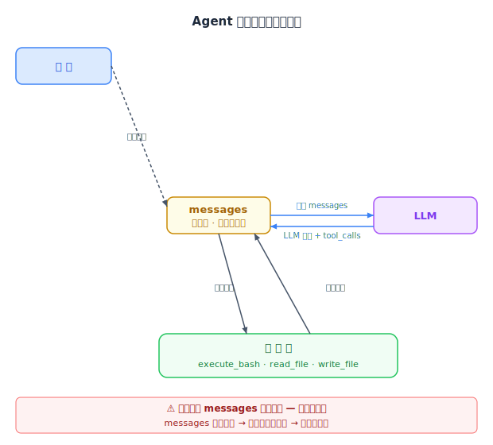
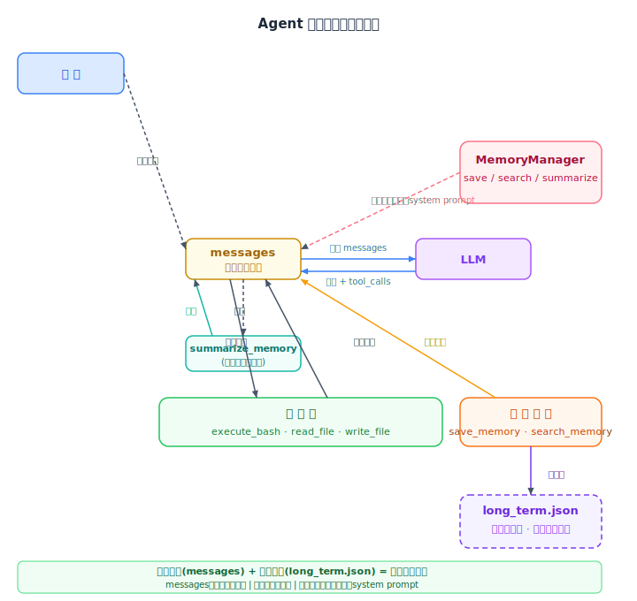
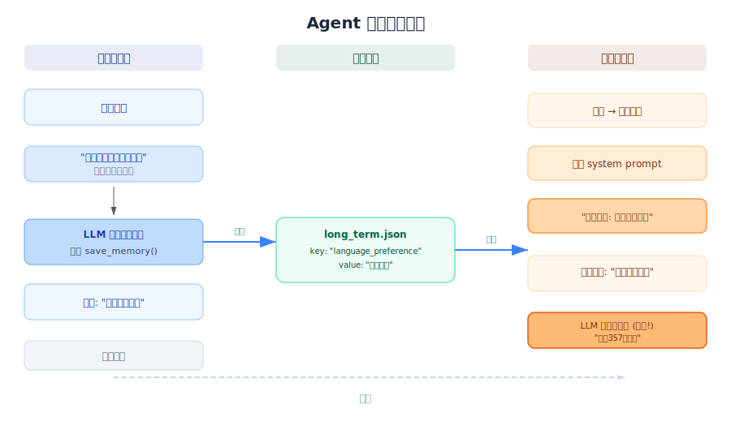

# 从零开始理解Agent(二)：记忆让Agent不再失忆

上一篇我们用最简单的100行代码，实现了一个能"感知 → 决策 → 行动"的Agent。结尾留了一个遗憾：这个Agent像一条金鱼，每次重启都是一张白纸。

这篇我们给它装上记忆。

---

## 一、Agent的"失忆症"

想象这样一个场景。

你对Agent说：

> "我的项目目录是 /home/app，记住它。"

Agent回答：

> "好的，已记住你的项目目录是 /home/app。"

然后你关掉终端。十分钟后重新打开，再问它同一个问题——

> "我的项目目录在哪？"

Agent茫然地回答：

> "抱歉，我不知道你的项目目录在哪里。"

不是它不愿意回答，而是它**真的忘了**。

上一篇代码里，Agent的记忆完全靠 `messages` 列表维持。这个列表在每次 `run_agent` 启动时从零构造，结束时随风而逝。Agent就像一个失忆的天才——每一世都聪明，但每一世都是从零开始。

更实际的问题是，即使在单次对话内，`messages` 也不断增长。上下文窗口就那么大，装多了就会溢出——最早的对话会被"遗忘"。你开头告诉它的需求，可能跑着跑着它就忘了。

这就是Agent面临的两种"失忆"：

| 类型 | 症状 | 原因 |
|------|------|------|
| **跨会话失忆** | 本次对话记的事下次忘了 | 每次启动 `messages` 重新初始化 |
| **会话内失忆** | 对话长了，开头说的内容被"挤出"上下文窗口 | `messages` 列表无限膨胀，超出token上限 |

怎么治这两种病？答案就在人类自己的记忆里：

- **短期记忆** = 当前正在聊的上下文，就是 `messages` 本身
- **长期记忆** = 把重要的事写到外部存储里，就像在笔记本上记账

接下来我们一步步实现这两件事。

---

## 二、短期记忆 & 长期记忆

### 用人类记忆来类比

你此刻读这篇文章，靠的是两种不同的记忆力：

**短期记忆**让你能理解"这篇"和"文章"之间的关系，记住上一句说了什么。但它容量很小，一旦被打断（比如突然有人叫你），刚才读的那半句可能就想不起来了。

**长期记忆**让你能记住自己的名字、母语、以及上一次编程的经验。这些不是"一直在脑子里装着"，而是需要时才能想起来——它们被存到了"硬盘"里。

Agent也需要这两种记忆。

| 维度 | 短期记忆 | 长期记忆 |
|------|----------|----------|
| 对应物 | `messages` 对话历史 | `long_term.json` 持久化文件 |
| 存储位置 | 内存 | 文件系统 |
| 生命周期 | 本次会话结束就没了 | 跨会话，永久保存 |
| 容量 | 受 LLM 的 context window 限制 | 理论上无限 |
| 内容 | 所有对话和工具执行结果 | 只挑关键信息保存 |
| 访问方式 | 全部发给 LLM | 按需查询、按需注入 |

### 关键区别

短期记忆是**被动**的——每一条对话都不加选择地塞进去，直到装不下为止。

长期记忆是**主动**的——Agent要自己判断什么值得记、怎么记、怎么找。这就带来一个问题：

> 什么信息值得记住？谁来做出这个判断？

这是记忆系统最大的挑战，我们后面会详细讲。先来看看短期记忆本身会遇到什么问题。

---

## 三、短期记忆：messages为什么会"撑爆"

### messages是怎么变长的

回顾上一篇的代码，每轮循环里：

```python
messages.append(message)               # LLM的回复
messages.append({"role": "tool", ...}) # 工具执行结果
```

每次LLM说话或者工具执行完，结果都往 `messages` 里追加。而且**每次调用LLM时，我们都是把整个 `messages` 列表传过去的**。

这就是为什么LLM能"记住"之前的对话——不是它有记忆能力，而是你每次都把整本日记重新读给它听。

### 为什么这是个问题

LLM的上下文窗口有上限。`gpt-4o-mini` 是128K token（大约10万字），`gpt-3.5-turbo` 只有16K。当你和Agent来回交互了20、30轮，加上工具返回的大段输出，很容易把这个窗口撑满。

一旦撑满，最早的消息就被截断了。你开头说的需求？Agent"忘"了。它开始在一个不完整的故事基础上继续推理——结果可想而知。

而且，每次把完整的 messages 传给LLM，成本和等待时间都在增长。第30轮的一次调用，比第一轮贵30倍，因为它要"读"前面29轮的日记。

### 解决方案：LLM自己总结自己

既然写不下，那就压缩。

最朴素的做法是：**让LLM把前面的对话压缩成一段摘要，用这段摘要替换掉原始的几十条消息。**

```python
# 当messages超过10条时
if len(messages) > SHORT_MEMORY_LIMIT:
    # 把messages[1:]发给LLM，让它生成2-3句话的摘要
    summary = llm_summarize(messages)
    # 用摘要替换原消息
    messages = [system_prompt, {"role": "assistant", "content": summary}]
```

打个比方：会议记录写了50页，没人有耐心看完。于是写一个"会议纪要"——谁提了什么需求、做了什么决定、遇到了什么障碍——一段话概括。后面的参与者读了摘要，就大致知道前面的情况。

这就是短期记忆的增强：**不是删除旧信息，而是把它浓缩。**

当然，摘要不可能保留所有细节。它更像是一张"导航地图"：大方向还在，小路被忽略了。对于大部分场景已经够用。

---

## 四、长期记忆：什么值得记

### 最省力的方案：让LLM自己决定

给长期记忆加工具很简单——写个 `save_memory(key, value)` 函数，把数据写入JSON文件就行。

**难的是决定什么时候调它。**

你可以每轮对话都强制让LLM反思"有没有值得记的信息"，但这多了一轮LLM调用，成本翻倍。你也可以写一堆规则和过滤器，但代码越写越复杂。

最省力的方案是在 system prompt 里直接告诉LLM：

> "当你遇到以下信息时，请调用 `save_memory` 工具保存：
> - 用户的偏好和习惯（比如'我喜欢用中文'）
> - 项目决策和约束条件（比如'不用向量数据库'）
> - 用户明确要求你记住的事实
> - 你犯了错误并且用户纠正了你
>
> 要精挑细选——只保存真正有用的信息。"

就这么几行，把判断权交给了LLM。

### 为什么这样可行

现代LLM在遵循指令方面已经足够聪明。它不是在每轮回答时"顺便想一想"，而是在Function Calling框架下，**与普通工具调用混在同一次响应中**。

也就是说，用户说"我喜欢用中文回答问题"，LLM的输出可能是这样的：

```json
{
  "content": "好的，我会用中文回答。",
  "tool_calls": [
    {
      "name": "save_memory",
      "arguments": {"key": "language_preference", "value": "用户喜欢用中文回答问题"}
    }
  ]
}
```

同一轮既回答了用户，又保存了记忆。零额外成本。

### 为什么不用更复杂的方案

你可能会想：记忆判断不是应该单独做一个模块吗？比如"反思层"或者"评分器"？

理论上是的。但工程上有一个判断标准：**如果prompt能解决60%的问题而代码要解决100%的问题，先用prompt。**

后续如果发现LLM记了太多废话或者漏记了重要信息，可以升级为"双通道"方案——每轮显式让LLM做一次记忆检查，或者用规则过滤掉太短、太泛的条目。但作为V1，system prompt 指导法足够启动。

---

## 五、代码实现：一步步加记忆

### 5.1 MemoryManager：记忆的保管员

所有跟记忆相关的操作，封装成一个类：

```python
class MemoryManager:
    def __init__(self, path="./memory/long_term.json"):
        self.path = path
        os.makedirs(os.path.dirname(self.path), exist_ok=True)
        self.memories = self._load()  # 启动时加载

    def _load(self):
        """从JSON文件加载记忆，文件不存在则返回空列表。"""
        if os.path.exists(self.path):
            with open(self.path, "r") as f:
                return json.load(f)
        return []

    def _save(self):
        """把内存中的所有条目写入JSON文件。"""
        with open(self.path, "w") as f:
            json.dump(self.memories, f, ensure_ascii=False, indent=2)

    def save(self, key, value):
        """保存或更新一条记忆。key存在则更新value，不存在则追加。"""
        for entry in self.memories:
            if entry["key"] == key:
                entry["value"] = value
                entry["timestamp"] = datetime.now().isoformat()
                self._save()
                return f"Updated memory: {key}"
        # 新增条目
        self.memories.append({
            "key": key,
            "value": value,
            "timestamp": datetime.now().isoformat(),
        })
        self._save()
        return f"Saved memory: {key}"

    def search(self, query):
        """按关键词模糊匹配key，返回匹配的条目。"""
        if not query:
            return self.memories
        return [e for e in self.memories if query.lower() in e["key"].lower()]
```

记忆的数据结构很简单，就是一个key-value加时间戳的列表：

```json
[
  {"key": "language_preference", "value": "用户喜欢用中文", "timestamp": "2026-04-01T10:30:00"},
  {"key": "project_dir", "value": "项目目录是/home/app", "timestamp": "2026-04-01T10:35:00"}
]
```

### 5.2 三个新工具

在原有的 `execute_bash`、`read_file`、`write_file` 基础上，加三个工具声明：

```python
# 工具声明（JSON格式的说明书）
{
    "type": "function",
    "function": {
        "name": "save_memory",
        "description": "Save a long-term memory entry to persistent storage",
        "parameters": {
            "properties": {
                "key": {"type": "string"},
                "value": {"type": "string"}
            },
            "required": ["key", "value"]
        }
    }
}
```

三个工具的职责：

| 工具 | 做什么 |
|------|--------|
| `save_memory` | 把 key-value 写到 `long_term.json` |
| `search_memory` | 按关键词匹配 key，返回符合条件的条目 |
| `summarize_memory` | 触发LLM对messages做摘要压缩 |

### 5.3 run_agent 改造

改造前的 `run_agent`（无记忆）：



改造后的 `run_agent`（带记忆）：



关键改动点：

```python
def run_agent(user_message, max_iterations=5):
    # 1. 加载长期记忆，注入到system prompt里
    knowledge = memory.get_all()
    system_prompt = _make_system_prompt(knowledge)

    messages = [
        {"role": "system", "content": system_prompt},
        {"role": "user", "content": user_message},
    ]

    for i in range(max_iterations):
        # 2. 短期记忆检查：消息过多时自动压缩
        if len(messages) > SHORT_MEMORY_LIMIT:
            messages = memory.summarize(messages, client)

        # 3. LLM调用
        response = client.chat.completions.create(
            model="gpt-4o-mini",
            messages=messages,
            tools=tools,       # 包含save_memory等新工具
        )

        # 4. 处理工具调用...
        for tool_call in message.tool_calls:
            if name == "save_memory":
                result = memory.save(args["key"], args["value"])
            elif name == "search_memory":
                result = json.dumps(memory.search(args["query"]))
            elif name == "summarize_memory":
                messages = memory.summarize(messages, client)
            # ... 其他工具照常处理
```

### 5.4 带记忆的system prompt长什么样

```
You are a helpful assistant with long-term memory capability.

你当前的记忆:
- language_preference: 用户喜欢用中文
- project_dir: 项目目录是/home/app

MEMORY RULES:
1. 遇到用户偏好、项目决策、用户要求记住的事实、你犯的错时，调用save_memory。
2. 精挑细选，只保存真正有用的信息。
3. 开始工作前，如果认为可能有相关的过去信息，调用search_memory查询。
4. 保持回复简洁。
```

这就是Agent"带着记忆出生"的方式。每次启动，这些已有的记忆条目都塞进system prompt里，相当于给Agent做了个快速" briefing"。

---

## 六、执行流程：有记忆的Agent是什么样的

### 一个完整例子

第一次会话：

```
用户: 我喜欢用中文回答问题，请记住这个偏好。
Agent: [内部判断：这是用户偏好，需要save_memory]
       → 调用 save_memory(key="language_preference", value="用户喜欢用中文")
       → 回复: "好的，我已经记住了。"
```

关闭终端。JSON文件里写入了：

```json
[{"key": "language_preference", "value": "用户喜欢用中文", "timestamp": "2026-04-01T10:30:00"}]
```

第二次会话（新的一天）：

```
用户: 帮我统计一下代码行数
Agent: [启动时加载JSON文件，system prompt包含"language_preference: 用户喜欢用中文"]
       → 知道用户喜欢中文，用中文回答
       → 调用 execute_bash("wc -l *.py")
       → 回复: "共有357行代码。"
```

Agent这一次"记得"了。它不是因为变聪明了，而是因为上次有人帮它写在了小本本上。

### 流程图



---

## 七、记忆方案的局限性和进化方向

### 当前方案不够好的地方

今天的方案能跑，但它离"真正的记忆系统"还很远。具体来说有四道坎：

**1. 关键词搜索太粗糙**

`search_memory` 只是字符串匹配。你记住了"我喜欢用Python写代码"，搜索时用"编程语言偏好"就找不到它。语义相近但关键词不匹配，等于没记。

**2. LLM自动判断会遗漏**

LLM不是百分百靠谱的。有时候重要的事它忘了记，有时候记了一堆废话。system prompt 写了规则，但它不是严格遵守规则的机器。

**3. 没有遗忘机制**

JSON文件只增不减（除非同一个key覆盖）。时间久了，记忆池越来越大，检索时噪音越来越多，真正需要的信息反而被淹没了。

**4. 摘要压缩会丢细节**

短记忆压缩成摘要是有损的。"会议纪要"代替不了"会议记录"，丢失的过程细节可能正是后面推理需要的。

### 当前主流Agent框架是怎么做的

| 框架 | 记忆方案 | 一句话说明 |
|------|----------|------------|
| **LangGraph / LangChain** | MemorySaver + 向量检索 | 利用 Checkpoint 保存图状态，配合向量数据库做语义检索 |
| **CrewAI** | Role-based Memory | 每个Agent按角色拥有独立记忆池（Short-term / Long-term / Entity Memory） |
| **AutoGen** | Shared Memory Bank | 多Agent通过共享的外部存储协作，支持多种后端实现 |
| **MetaGPT** | SOP驱动的持久化记忆 | 任务完成时把经验写入SOP文档，下一轮直接加载，强调流程沉淀 |
| **Claude (Anthropic)** | 大窗口 + Project Rules | 靠200K上下文装更多东西 + 项目级规则文件做跨引导 |

它们共同在做的事：**把记忆从模型上下文窗口中解放出来，存在外部，按需检索，再注入回来。**

### 从"小本本"到"图书馆"

从今天的JSON小本本，到工业级的记忆系统，中间有几步可以走：

| 当前方案 | 进化方向 | 说明 |
|----------|----------|------|
| 关键词匹配 | **向量数据库**（embeddings + 语义检索） | 不再匹配关键词，而是计算"意思相近"——用Embedding模型把记忆和查询都转成向量，按相似度排序 |
| LLM手动判断 | **自动反思层** | 每轮对话后，用一个独立的LLM调用扫描对话内容，自动提取值得记住的信息，不依赖主模型的"自觉" |
| 无限堆积 | **记忆衰减**（Memories Decay） | 时间越久的记忆权重越低，长期不访问的记忆被归档或删除。让记忆系统自动"遗忘"不重要的东西 |
| 平面 key-value | **图结构记忆** | 记忆节点之间建立关系边。不是"存了一堆条目"而是"记住了一张网"——"用户→喜欢→中文"，"项目→用→Python" |
| 单Agent记忆 | **多Agent共享记忆** | 多个Agent协作时，经验互通。一个Agent学到的教训，另一个Agent可以直接用 |

### 一句话收尾

我们今天做的"JSON小本本"很简陋，但理解了它，再看 LangGraph 的 MemorySaver、CrewAI 的 Entity Memory、向量检索的语义匹配，就不会觉得神秘了。所有记忆方案的本质，都是一件事：

> **在合适的时间，把合适的信息，放进模型的上下文里。**

差别只在"怎么存"和"怎么找"上。
