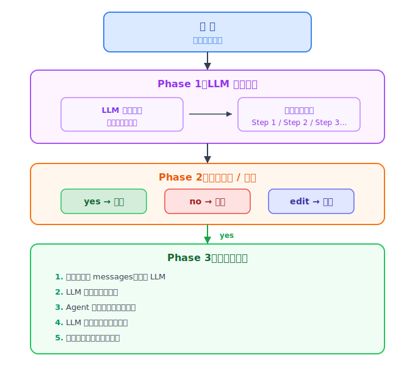

# 从零开始理解Agent(四)：给Agent装上"先想再做"的能力

第一篇我们用 100 行代码，实现了一个能"感知 → 决策 → 行动"的 Agent。第二篇给它装上了记忆系统，解决了跨会话失忆和上下文撑爆的问题。第三篇让它支持多轮对话，不用跑一轮就关掉。

但还有一件事，让这个 Agent 离"真正能干活的助手"差了一口气——它拿到任务就直奔工具，走一步算一步，没有一个全局计划。

这篇我们给它补上这个能力：**先规划，再执行**。

---

## 一、什么是计划？为什么 Agent 需要它

想象你让一个朋友帮你干一件事：

> "帮我把公司过去一年的财务报表整理一下，分析出每个月的收入趋势，写一份报告，发到我的邮箱。"

没有计划的人会怎么做？打开电脑 → 随便找一个文件夹 → 发现找不到文件 → 问你在哪 → 找到一个 → 开始看 → 发现格式不对 → 又来问你用什么软件打开……

有计划的人会怎么做？先在脑子里过一遍：

> 第一步：找到财务数据在哪
> 第二步：确认文件格式，能打开
> 第三步：按月提取收入数据
> 第四步：画趋势图，写成报告
> 第五步：配置邮箱，发送

**区别不在能力，在于有没有"先想再做"。** 有计划的行动少走弯路。

### Agent的"无计划症"

回顾一下之前的 Agent（agent_3.py）。它的工作方式是：

```
用户输入 → LLM 判断要不要调工具 → 调就执行，不调就回答 → 循环
```

没有计划，LLM 每轮都是"看到什么做什么"。对于"帮我统计代码行数"这种简单任务没问题。但如果你说：

> "读取 trip.md 的内容，找出其中提到的所有景点，搜索这些景点的门票价格，统计总花费，写一个新的文件。"

无计划的 Agent 可能会：
1. 读了 trip.md → 忘了要找景点 → 直接返回文件内容
2. 或者找到了景点，但忘了下一步要搜索门票 → 直接结束
3. 或者搜索了门票，但忘了统计总花费 → 一堆散乱的数字

就像一个没有地图的旅行者，方向大致正确，但每一步都在随机绕路。

### 计划到底解决了什么

| 没有计划 | 有计划 |
|---------|--------|
| 走一步看一步，容易漏步骤 | 全局视角，步骤一目了然 |
| LLM 上下文越长，越容易"忘记开头要干嘛" | 计划就像贴在墙上的任务清单，随时提醒 |
| 用户不知道 Agent 在干嘛，只能等结果 | 用户可以提前看计划，确认对不对，甚至动手改 |
| 中间走偏了很难发现 | 可以对比计划和实际执行，发现偏离 |

计划不是多花一次 LLM 调用。它是**在动手之前，先让 LLM 把自己说服**。

---

## 二、方案设计：Plan → Confirm → Execute

### 核心思路

在 `AgentSession.step()` 中插入一个 "plan 阶段"，让每次执行任务之前都有三步：

```
1. Plan（规划）  → LLM 根据用户输入，生成可执行的步骤计划
2. Confirm（确认）→ 用户看计划，决定 yes / no / edit
3. Execute（执行）→ 按计划逐步执行，LLM 调用工具完成任务
```



### 三种用户操作

用户看到计划后有三个选择：

| 选项 | 含义 |
|------|------|
| **yes** | 计划合理，按计划执行 |
| **no** | 不想做了，取消任务 |
| **edit** | 用户手动修改计划内容，然后再执行 |

为什么要让用户可以 edit？因为 LLM 生成的计划不一定是对的，用户可能在脑子里有更清晰的步骤。允许 edit 意味着用户不只是旁观者，而是可以参与塑造 Agent 的行动方案。

### 跟之前的代码怎么衔接

好消息是：大部分代码不需要改。

`MemoryManager` 不需要变——记忆系统在计划阶段和执行阶段都能用。
工具列表不需要变——还是那六个工具。
`_ensure_system_prompt()` 不需要变——记忆压缩照常工作。

真正的改动只有两个：
1. 新增一个 `_plan()` 方法，调用 LLM 生成计划
2. 改造 `step()` 方法，在执行之前加入"生成计划 → 确认"两个阶段

---

## 三、代码实现

### 3.1 `_plan()` 方法：LLM 当规划师

```python
def _plan(self, user_message: str) -> str:
    """请求 LLM 为用户任务生成可执行的步骤计划。"""
    plan_req = [
        {"role": "system", "content": """You are a task planner. Given a user request,
break it down into numbered steps (1-5). Each step should be clear and actionable.

Rules:
- Use format: "Step 1: ... \nStep 2: ... \nStep 3: ..."
- Only output the steps, nothing else.
- Keep steps concise and actionable."""},
        {"role": "user", "content": user_message},
    ]
    resp = client.chat.completions.create(
        model=os.environ.get("OPENAI_MODEL", "DeepSeek-V3.2"),
        messages=plan_req,
    )
    return resp.choices[0].message.content
```

这跟普通的 LLM 调用没区别——一个 system prompt 定义角色，一条用户消息承载任务。唯一不同是返回的不是"回答"，而是一个**步骤计划**。

打个比方：之前 Agent 看到任务就想"我该用什么工具"，现在 Agent 看到任务先想"我应该分几步做"。从"工具视角"变成了"任务视角"。

### 3.2 `_confirm_plan()` 方法：让用户把关

```python
def _confirm_plan(self, plan: str) -> str | None:
    """展示计划给用户，支持 yes/no/edit。返回最终计划或 None（取消）。"""
    while True:
        print("=" * 50)
        print("Execution Plan:")
        print(plan)
        print("=" * 50)

        answer = input("\n执行上述计划？[yes/no/edit]: ").strip().lower()

        if answer in ("y", "yes"):
            return plan
        elif answer in ("n", "no"):
            return None
        elif answer in ("e", "edit"):
            # 用户手动修改计划
            print("\n请输入修改后的完整计划（空行结束）：")
            new_plan = ""
            while True:
                line = input()
                if line.strip() == "":
                    break
                new_plan += line + "\n"
            plan = new_plan.strip()
        else:
            continue
```

这个方法做了一件事：**在 LLM 的计划和 Agent 的执行之间，插入了一个人类的"审批层"。**

为什么需要这个审批层？因为 LLM 不是完美的。它可能会：
- 理解错你的意图，生成一个不靠谱的计划
- 遗漏某些关键步骤
- 顺序搞反了（比如先发送邮件再写报告）

用户看了计划后，如果觉得不对可以 edit 改成自己想要的方式。这不是不信任 LLM，而是让人的判断力和 LLM 的执行力结合。

### 3.3 改造 `step()` 方法

改造前的 `step()`（agent_3.py）：

```python
def step(self, user_message: str, max_iterations: int = 10) -> str:
    self._ensure_system_prompt()
    self.messages.append({"role": "user", "content": user_message})
    # 直接进入 agent 循环...
    for i in range(max_iterations):
        response = client.chat.completions.create(...)
```

改造后的 `step()`（agent_4.py）：

```python
def step(self, user_message: str, max_iterations: int = 10) -> str:
    self._ensure_system_prompt()

    # 阶段 1：生成执行计划
    plan = self._plan(user_message)

    # 阶段 2：征求用户确认
    confirmed_plan = self._confirm_plan(plan)
    if confirmed_plan is None:
        return "任务已取消。"

    # 阶段 3：将任务和计划注入消息，开始执行
    self.messages.append({
        "role": "user",
        "content": f"Task: {user_message}\n\n"
                    f"Your execution plan (follow it strictly):\n{confirmed_plan}",
    })

    print("\n[Agent] Executing plan...")
    return self._execute_loop(confirmed_plan, max_iterations)
```

对比一下，三步变化：
1. 多了一次 LLM 调用生成计划
2. 多了一次用户交互确认
3. 用户消息里加入了计划，让 LLM 在执行时"看到"这份计划

### 3.4 `_execute_loop()` 方法：独立出执行循环

把原来的 agent 循环提取到一个单独方法里：

```python
def _execute_loop(self, plan: str, max_iterations: int = 10) -> str:
    """按计划执行任务的标准工具循环。"""
    for _ in range(max_iterations):
        response = client.chat.completions.create(
            model=os.environ.get("OPENAI_MODEL", "DeepSeek-V3.2"),
            messages=self.messages,
            tools=tools,
        )
        message = response.choices[0].message
        self.messages.append(message)

        if not message.tool_calls:
            return message.content

        for tool_call in message.tool_calls:
            # ... 工具处理逻辑（跟 agent_3.py 完全一样）
```

为什么单独提出来？因为 `step()` 方法已经够长了——生成计划、确认、执行，三段代码堆在一起不好看。把执行循环抽到 `_execute_loop()` 里，职责清晰：

- `_plan()` — 想
- `_confirm_plan()` — 问
- `_execute_loop()` — 做

---

## 四、执行流程：一个完整的例子

用户输入：

> "帮我写一份清明出游黄山的计划，保存到 trip.md"

### 阶段 1：LLM 生成计划

Agent 调用 `_plan()`，LLM 输出：

```
Step 1: 检索长期记忆，看是否有过去出行计划的用户偏好
Step 2: 搜索黄山景点信息、交通和住宿资料
Step 3: 根据用户偏好制定三天行程
Step 4: 编写完整的出行计划文档，包含行程、费用、注意事项
Step 5: 将文档保存到 trip.md
```

### 阶段 2：用户确认

终端打印：

```
==================================================
Execution Plan:
Step 1: 检索长期记忆，看是否有过去出行计划的用户偏好
Step 2: 搜索黄山景点信息、交通和住宿资料
Step 3: 根据用户偏好制定三天行程
Step 4: 编写完整的出行计划文档，包含行程、费用、注意事项
Step 5: 将文档保存到 trip.md
==================================================

执行上述计划？[yes/no/edit]:
```

用户觉得没问题，输入 `yes`。

### 阶段 3：按计划执行

```
[Agent] Executing plan...
[Tool] search_memory({'query': 'preference'})
[Tool] execute_bash({'command': 'curl -s ...'})
[Tool] write_file({'path': 'trip.md', 'content': '...'})
```

LLM 按照计划，先搜记忆、再查资料、再写文件。最终输出：

> 黄山出行计划已保存到 `trip.md`。

### 如果用户选了 edit

假设用户觉得 LLM 的计划少了点什么，选了 `edit`：

```
执行上述计划？[yes/no/edit]: edit

请输入修改后的完整计划（空行结束）：
Step 1: 检索长期记忆，看是否有过去出行计划的用户偏好
Step 2: 查询黄山最近一周的天气预报
Step 3: 搜索黄山景点信息、交通和住宿资料
Step 4: 根据用户偏好制定三天行程
Step 5: 编写完整的出行计划文档
Step 6: 将文档保存到 trip.md

Updated Plan:
Step 1: 检索长期记忆，看是否有过去出行计划的用户偏好
Step 2: 查询黄山最近一周的天气预报
Step 3: 搜索黄山景点信息、交通和住宿资料
Step 4: 根据用户偏好制定三天行程
Step 5: 编写完整的出行计划文档
Step 6: 将文档保存到 trip.md

执行上述计划？[yes/no/edit]: yes
```

用户加了一个"查询天气预报"的步骤。Agent 按修改后的计划执行。

---

## 五、"想"和"做"之间的关系值得细想

### 计划不是"另起一次对话"

一个容易产生的误解是：生成计划和执行任务，是两次独立的 LLM 调用。

实际上，在 `step()` 方法里，计划生成后并没有丢掉。它被拼进了发给 LLM 的用户消息里：

```python
self.messages.append({
    "role": "user",
    "content": f"Task: {user_message}\n\n"
                f"Your execution plan (follow it strictly):\n{confirmed_plan}",
})
```

这意味着：**执行阶段的 LLM 能看到这份计划。** 它不是在一个真空里随机调工具，而是在"照着计划做"。

打个比方：计划不是写完就扔的草稿，而是贴在墙上的备忘录。做着做着抬头看一眼——"我现在该做第几步了？"

### 为什么把计划和任务一起发给 LLM

你可能会想：既然 LLM 在 `step()` 里又要生成计划，又要按计划执行，那能不能一步到位——在生成计划的同时就执行？

答案是：**技术上可以，但体验上不好。**

一步到位意味着用户看不到计划，不能 edit，不能取消。LLM 的计划质量再高，也会偶尔出错。一旦出错，Agent 就按错误的计划白跑了好几轮工具调用。

分两步走，多了一次 LLM 调用，但换来了：
- 用户可以在执行前发现计划的缺陷
- 用户可以加入自己对任务的理解
- 用户可以取消一个不需要的任务（省了执行的成本）

这是一个**用少量成本换取可控性**的 tradeoff。

### 计划不是万能的

计划阶段和第一阶段一样，靠的是 LLM 的文本生成能力。它的弱点跟普通对话没有区别：

- **它不了解你的项目的具体情况**——比如"不能用向量数据库因为公司不允许"
- **它可能会遗漏隐藏步骤**——比如"先安装 requests 库再写脚本"
- **它不能验证计划的可行性**——它说"搜索黄山天气"，但你的机器上没装 curl

这就是为什么需要人类的确认和修正。LLM 负责"想得全面"，人类负责"判断靠不靠谱"。

---

## 六、代码结构对比

### agent_3.py vs agent_4.py

| 维度 | agent_3.py | agent_4.py |
|------|-----------|-----------|
| `step()` 做了什么 | 直接追加用户消息 → 进入 agent 循环 | 生成计划 → 用户确认 → 注入计划 → 执行 |
| 新方法 | 无 | `_plan()`、`_confirm_plan()`、`_execute_loop()` |
| LLM 调用次数（每轮最少） | 1 次 | 2 次（plan + 执行） |
| 用户交互 | 输入任务 → 等待结果 | 输入任务 → 看计划 → yes/no/edit → 等待结果 |
| 适用场景 | 简单、确定性的任务 | 复杂、多步骤、需要确认的任务 |

### 方法职责一览

```
AgentSession
├── _ensure_system_prompt()   # 设置 system prompt，检查记忆压缩（不变）
├── _plan(user_message)        # ★ 新增：LLM 生成可执行步骤
├── _confirm_plan(plan)        # ★ 新增：用户确认/修改计划
├── _execute_loop(plan)        # ★ 新增：按计划执行的标准循环
└── step(user_message)         # ★ 改造：串联上面三个方法
```

MemoryManager 没有变化，第二篇和第三篇的记忆能力在 `step()` 的每一步都自动生效。

---

## 七、当前方案的局限性

### 1. 计划阶段多了一次 LLM 调用

每轮 `step()` 至少多了一次 LLM 调用（生成计划）。对于 GPT-4 这样贵的模型，成本会显著增加。简单任务（"帮我统计代码行数"）其实不需要计划。

**怎么改进？**

给 Agent 一个"判断是否要规划"的能力——简单任务跳过 plan 阶段直接执行，复杂任务才生成计划。可以在 system prompt 里告诉 LLM，也可以用一个独立的小模型来判断任务复杂度。

### 2. 计划不是动态的

现在的计划是"一次性生成，按此执行"。执行过程中如果发现某步走不通（比如搜索不到某个信息），Agent 不会自动调整计划，可能会在一个步骤上反复卡住。

**怎么改进？**

在执行循环中加入"计划检查"——每完成一步，对比计划，看是否偏离。如果某步失败，让 LLM 重新规划后续步骤。这就是 ReAct 框架中的"反思"：行动后观察结果，结果不好就换个思路。

### 3. 计划的粒度靠 LLM 自己判断

`_plan()` 的 system prompt 要求 LLM 把任务分解成 1-5 步。但 LLM 的判断不一定靠谱——它可能把一个简单的任务分解成 5 步（过度设计），也可能把一个复杂的任务压缩成 2 步（过度简化）。

**怎么改进？**

用更结构化的 prompt，或者让 Agent 根据已有的工具列表来生成计划——每一步对应一个具体的工具调用，而不是模糊的文本描述。

### 4. edit 方案的体验有待提高

当前的 edit 是"整个计划重新输入"——用户要把整份计划复制、修改、粘贴。如果只想改其中一步，要重写全部。

**怎么改进？**

支持行级编辑——"把 Step 2 改成：查询黄山天气预报"，或者用交互式菜单让用户选择要修改的步骤。

### 当前主流框架是怎么做的

| 框架 | 规划方案 | 一句话说明 |
|------|---------|------------|
| **LangGraph** | Plan-and-Execute | 先由 Planner 生成子任务列表，Executor 逐个完成，动态调整 |
| **CrewAI** | Hierarchical Process | Manager Agent 分解任务分发给 Worker Agents，按层级执行 |
| **AutoGen** | Group Chat | 多个 Agent 在一个群组中讨论计划，达成共识后各自执行 |
| **MetaGPT** | SOP 驱动 | 按照预定义的标准流程（SOP）来规划和分配角色 |
| **OpenManus** | ReAct 循环 | 思考 → 行动 → 观察 → 再思考，单 Agent 自主规划与执行 |

它们的共同点是：**把"想"和"做"分离成两个阶段，但允许在执行过程中动态调整计划。** 这比我们的"一次计划执行到底"更灵活。

---

## 八、四篇串起来

回顾一下这四篇的 Agent 进化史：

| 篇 | 解决的问题 | 一句话 |
|----|-----------|--------|
| 第一篇 | Agent 是什么 | 感知 → 决策 → 行动的循环 |
| 第二篇 | Agent 记不住 | 短期记忆压缩 + 长期记忆持久化 |
| 第三篇 | Agent 不会聊 | 多轮复用 messages，不销毁、不重启 |
| 第四篇 | Agent 不会想 | 先规划再执行，让 LLM 自己说服自己 |

第一篇的 Agent 是**无头苍蝇**——有手有脚但不知道要去哪。

第二篇的 Agent 有了**笔记本**——重要的事写在上面，下次接着用。

第三篇的 Agent 有了**电话线**——不用每次都说一遍"我是谁，我要干嘛"。

第四篇的Agent有了**任务清单**——动手之前把步骤列清楚。

它还是那个 Agent——感知靠 messages，决策靠 LLM，行动靠工具。但每一步都比上次更"靠谱"一点。

不是每篇文章都加了新模型、新 API、新框架。恰恰相反，每一篇都是在已有代码的基础上多几行。Agent 不需要重写——它需要**增量改进**。

### 四篇一句话总结

| 篇 | 核心概念 | 本质 |
|----|---------|------|
| 第一篇 | 感知 → 决策 → 行动 | 循环 |
| 第二篇 | 短期压缩 + 长期持久化 | 记忆 |
| 第三篇 | messages 不销毁 | 持续 |
| 第四篇 | 先生成计划再执行 | 规划 |

不需要理解 Transformer 的架构，不需要知道模型是怎么训练的。你只需要理解这六个词：感知、决策、行动、记忆、持续、规划。

这才是 AI 工程化最朴素的真相。

参考代码：https://github.com/AutomaticProgramming/Agent/blob/main/agent_4.py
